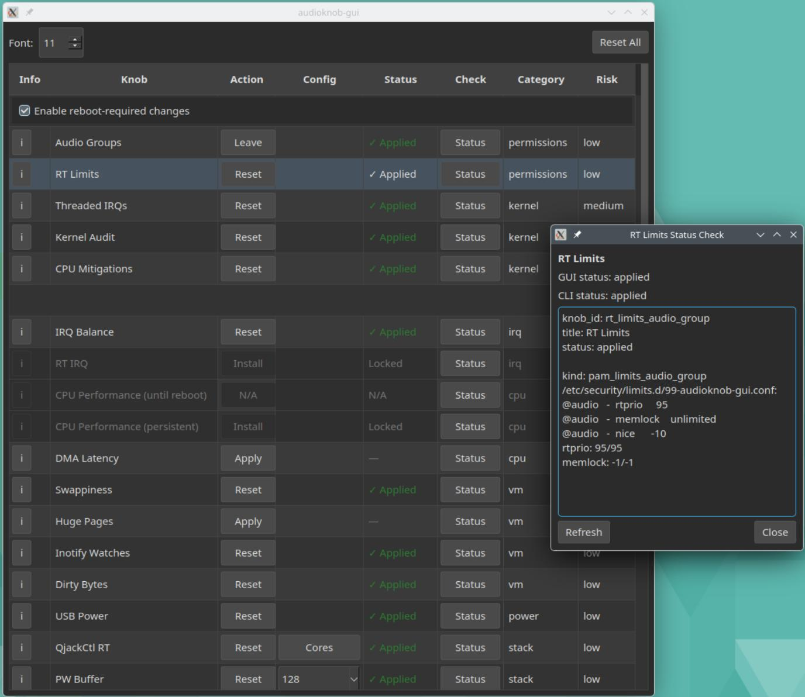

# audioknob-gui

GUI-first realtime audio tuning tool for Linux.



## Install

The **v0.3.5.1** RPM install path is validated on openSUSE Tumbleweed.
Fedora and Ubuntu currently use the dev-install flow below.

### openSUSE Tumbleweed (local RPM)

### 1) Install prerequisites (including git)

```bash
sudo zypper install -y \
  git-core \
  rpm-build \
  python313 python313-devel python313-pip python313-setuptools python313-wheel \
  python313-pyside6 \
  python-rpm-macros \
  desktop-file-utils \
  polkit
```

### 2) Clone the repo

```bash
git clone https://github.com/chrisoctane/audioknob-gui.git
cd audioknob-gui
```

### 3) Build the RPM (local)

```bash
./packaging/opensuse/build-rpm.sh
```

Expected output includes:

- `Built RPM(s):`
- `~/rpmbuild/RPMS/noarch/audioknob-gui-0.3.5.1-0.noarch.rpm`

### 4) Install the RPM (unsigned local build)

Local RPMs are typically **unsigned**, and `zypper` will refuse them unless you opt in:

```bash
sudo zypper --no-gpg-checks install -y ~/rpmbuild/RPMS/noarch/audioknob-gui-*.rpm
```

### 5) Verify install

```bash
rpm -q audioknob-gui
command -v audioknob-gui
ls -l /usr/libexec/audioknob-gui-worker /usr/share/polkit-1/actions/org.audioknob-gui.policy
```

Launch:

```bash
audioknob-gui
```

Or launch it from your desktop environment’s application menu:

- **Name**: “AudioKnob GUI”
- **Desktop entry**: `/usr/share/applications/audioknob-gui.desktop`

### 6) Optional: Refresh & rebuild (pull latest)

```bash
cd ~/audioknob-gui
git pull
./packaging/opensuse/build-rpm.sh
sudo zypper --no-gpg-checks install -y ~/rpmbuild/RPMS/noarch/audioknob-gui-*.rpm
```

### 7) Uninstall

```bash
sudo zypper remove -y audioknob-gui
```

### 7a) Dev uninstall (wipe + reset VM)

For a dev-only "start fresh" reset (clears transactions/state, restores defaults, removes group memberships, and optionally removes dependencies):

```bash
./scripts/dev-uninstall.sh --yes
```

### 8) Cleanup old dev artifacts (optional)

If you previously installed a dev polkit worker/policy under `/usr/local`, remove them:

```bash
sudo rm -f /usr/local/libexec/audioknob-gui-worker \
           /usr/share/polkit-1/actions/org.audioknob-gui.policy
rm -f ~/.local/share/applications/audioknob-gui.desktop
update-desktop-database ~/.local/share/applications 2>/dev/null || true
```

### 9) Cleanup (optional)

Remove user GUI state (this does **not** remove any system changes you applied; use the app’s “Reset All” for that):

```bash
rm -f "${XDG_STATE_HOME:-$HOME/.local/state}/audioknob-gui/state.json"
```

Remove local build scratch (keeps the produced RPMs):

```bash
rm -rf ~/rpmbuild/BUILD ~/rpmbuild/BUILDROOT ~/rpmbuild/SOURCES ~/rpmbuild/OTHER ~/rpmbuild/SPECS
```

### Notes

- Root operations are performed via polkit using a fixed-path worker at:
  - `/usr/libexec/audioknob-gui-worker`

### Fedora (dev install from source)

#### 1) Install prerequisites

```bash
sudo dnf install -y \
  git-core \
  python3 python3-devel python3-pip python3-setuptools python3-wheel \
  desktop-file-utils \
  polkit
```

Optional (if available in your repo): `sudo dnf install -y python3-pyside6`

#### 2) Clone the repo

```bash
git clone https://github.com/chrisoctane/audioknob-gui.git
cd audioknob-gui
git checkout feature/distro-startup-scan
```

#### 3) Build (venv) + install Python deps

```bash
python3 -m venv .venv
. .venv/bin/activate
pip install -U pip setuptools wheel
pip install -e .
```

#### 4) Install polkit worker + policy (system)

```bash
sudo ./packaging/install-polkit.sh
```

#### 5) Install desktop entry (user)

```bash
./scripts/install-desktop.sh
```

#### 6) Launch

```bash
audioknob-gui
```

#### 7) Dev uninstall (wipe + reset VM)

```bash
./scripts/dev-uninstall.sh --yes
```

### Ubuntu (dev install from source)

#### 1) Install prerequisites

```bash
sudo apt update
sudo apt install -y \
  git \
  python3 python3-venv python3-pip python3-setuptools python3-wheel python3-dev \
  desktop-file-utils
```

PySide6 is installed via `pip` in the venv below. If `pip install -e .` fails on
your Python version, use Python 3.12 for the venv.

If `pkexec` is missing, install polkit:

```bash
sudo apt install -y polkitd pkexec
```

If `polkitd` or `pkexec` are not found, enable Universe and retry:

```bash
sudo add-apt-repository universe
sudo apt update
```

#### 2) Clone the repo

```bash
git clone https://github.com/chrisoctane/audioknob-gui.git
cd audioknob-gui
git checkout feature/distro-startup-scan
```

#### 3) Build (venv) + install Python deps

```bash
python3 -m venv .venv
. .venv/bin/activate
pip install -U pip setuptools wheel
pip install -e .
```

If PySide6 fails to install with Python 3.13, use Python 3.12 for the venv:

```bash
sudo apt install -y python3.12 python3.12-venv python3.12-dev
python3.12 -m venv .venv
. .venv/bin/activate
pip install -U pip setuptools wheel
pip install -e .
```

#### 4) Install polkit worker + policy (system)

```bash
sudo ./packaging/install-polkit.sh
```

#### 5) Install desktop entry (user)

```bash
./scripts/install-desktop.sh
```

#### 6) Launch

```bash
audioknob-gui
```

#### 7) Dev uninstall (wipe + reset VM)

```bash
./scripts/dev-uninstall.sh --yes
```

## Signed RPM via OBS (future)

The local-RPM flow above requires `--no-gpg-checks` because the RPM is unsigned.

The production path is to publish a **signed** RPM via the openSUSE **Open Build Service (OBS)** so users can install from a repo.


## Development

See `PLAN.md` (quick start) and `PROJECT_STATE.md` (architecture + operator contract).
