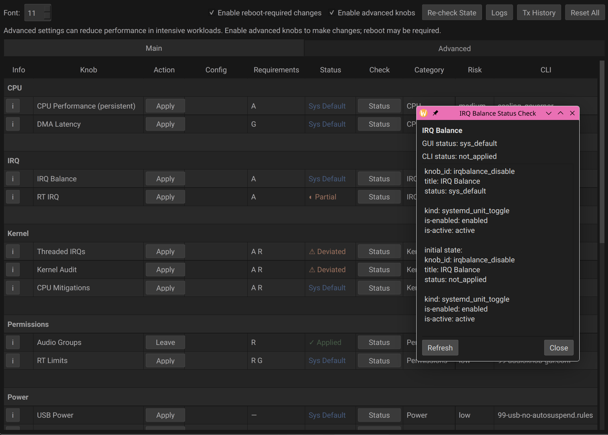

# audioknob-gui

GUI-first realtime audio tuning tool for Linux.



## Install

The **v0.4.2** local package paths cover:

- openSUSE Tumbleweed (RPM)
- Debian/Ubuntu (DEB)

### openSUSE Tumbleweed (local RPM)

### 1) Install prerequisites (including git)

```bash
sudo zypper install -y \
  git-core \
  rpm-build \
  python313 python313-devel python313-pip python313-setuptools python313-wheel \
  python313-pyside6 \
  python-rpm-macros \
  desktop-file-utils \
  polkit
```

### 2) Clone the repo

```bash
git clone https://github.com/chrisoctane/audioknob-gui.git
cd audioknob-gui
```

### 3) Build the RPM (local)

```bash
./packaging/opensuse/build-rpm.sh
```

Expected output includes:

- `Built RPM(s):`
- `~/rpmbuild/RPMS/noarch/audioknob-gui-0.4.2-0.noarch.rpm`

### 4) Install the RPM (unsigned local build)

Local RPMs are typically **unsigned**, and `zypper` will refuse them unless you opt in:

```bash
sudo zypper --no-gpg-checks install -y ~/rpmbuild/RPMS/noarch/audioknob-gui-*.rpm
```

### 5) Verify install

```bash
rpm -q audioknob-gui
command -v audioknob-gui
ls -l /usr/libexec/audioknob-gui-worker /usr/share/polkit-1/actions/org.audioknob-gui.policy
```

Launch:

```bash
audioknob-gui
```

Or launch it from your desktop environment’s application menu:

- **Name**: “AudioKnob GUI”
- **Desktop entry**: `/usr/share/applications/audioknob-gui.desktop`

### 6) Optional: Refresh & rebuild (pull latest)

```bash
cd ~/audioknob-gui
git pull
./packaging/opensuse/build-rpm.sh
sudo zypper --no-gpg-checks install -y ~/rpmbuild/RPMS/noarch/audioknob-gui-*.rpm
```

### 7) Uninstall

```bash
sudo zypper remove -y audioknob-gui
```

### 7a) Dev uninstall (wipe + reset VM)

For a dev-only "start fresh" reset (clears transactions/state, restores defaults, removes group memberships, and optionally removes dependencies):

```bash
./scripts/dev-uninstall.sh --yes
```

### 8) Cleanup old dev artifacts (optional)

If you previously installed a dev polkit worker/policy under `/usr/local`, remove them:

```bash
sudo rm -f /usr/local/libexec/audioknob-gui-worker \
           /usr/share/polkit-1/actions/org.audioknob-gui.policy
rm -f ~/.local/share/applications/audioknob-gui.desktop
update-desktop-database ~/.local/share/applications 2>/dev/null || true
```

### 9) Cleanup (optional)

Remove user GUI state (this does **not** remove any system changes you applied; use the app’s “Reset All” for that):

```bash
rm -f "${XDG_STATE_HOME:-$HOME/.local/state}/audioknob-gui/state.json"
```

Remove local build scratch (keeps the produced RPMs):

```bash
rm -rf ~/rpmbuild/BUILD ~/rpmbuild/BUILDROOT ~/rpmbuild/SOURCES ~/rpmbuild/OTHER ~/rpmbuild/SPECS
```

### Notes

- Root operations are performed via polkit using a fixed-path worker at:
  - `/usr/libexec/audioknob-gui-worker`

### Debian/Ubuntu (local .deb)

### 1) Install prerequisites (including git)

```bash
sudo apt-get update
sudo apt-get install -y \
  git \
  dpkg-dev \
  python3 python3-pip python3-setuptools python3-wheel \
  desktop-file-utils \
  polkitd pkexec
```

### 2) Clone the repo

```bash
git clone https://github.com/chrisoctane/audioknob-gui.git
cd audioknob-gui
```

### 3) Build the DEB (local)

```bash
./packaging/debian/build-deb.sh
```

Expected output includes:

- `Built DEB:`
- `~/debbuild/audioknob-gui_0.4.2_all.deb`

### 4) Install the DEB

```bash
sudo apt-get install -y ~/debbuild/audioknob-gui_*_all.deb
```

### 5) Verify install

```bash
dpkg -l audioknob-gui
command -v audioknob-gui
ls -l /usr/libexec/audioknob-gui-worker /usr/share/polkit-1/actions/org.audioknob-gui.policy
```

Launch:

```bash
audioknob-gui
```

### 6) Optional: Refresh & rebuild (pull latest)

```bash
cd ~/audioknob-gui
git pull
./packaging/debian/build-deb.sh
sudo apt-get install -y ~/debbuild/audioknob-gui_*_all.deb
```

### 7) Uninstall

```bash
sudo apt-get remove -y audioknob-gui
```

### Notes

- The .deb build downloads PySide6 wheels via pip and bundles them in the package (network required).
- On Debian, the polkit package name may be `policykit-1` instead of `polkitd`/`pkexec`.

## Signed RPM via OBS (future)

The local-RPM flow above requires `--no-gpg-checks` because the RPM is unsigned.

The production path is to publish a **signed** RPM via the openSUSE **Open Build Service (OBS)** so users can install from a repo.


## Development

See `PLAN.md` (quick start) and `PROJECT_STATE.md` (architecture + operator contract).
